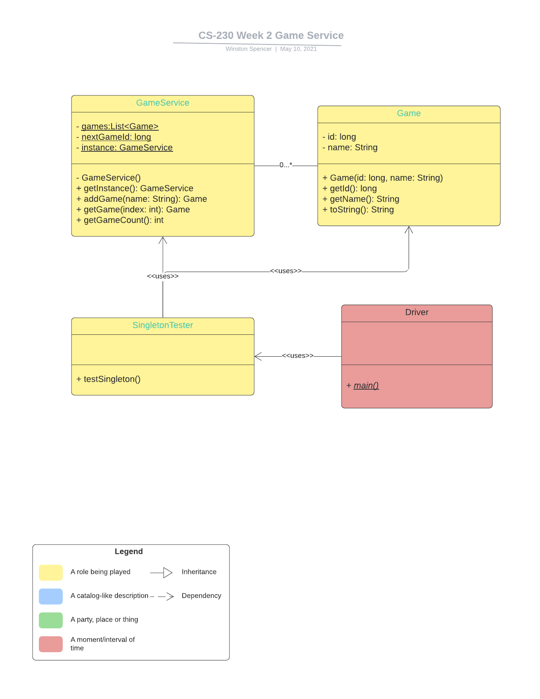

# Game-Room
  The Gaming Room Client has reimagined the 1980’s hit television game Win, Lose or Draw.  They have developed a mobile version of the game called Draw It or Lose solely for the android platform. The client is now seeking to expand the game. This new version of Draw It or Lose will allow users across multiple platforms to compete via the internet.

## Week 8 Answers

#### What went well
    While developing this documentation, the diagrams turned out very well. They were simplify and clarify each section using appropriate images.
    
#### Design Process
    The detailed use cases and requrements were very helpfull when developing the application.

#### Revision
    If I could choose one part of the sofware requrements to revise it would be the use cases.  While the use cases were great, they could be better by using images.  A screenshot of each use case would help remove doubts are questions.
    
#### User Needs
    The first step to understanding the user needs is to activly listen to the user.  The second step is to have the user review each work product and activly listen to their feedback.

#### Technique and Strategies
    When designing the software it is best to start with the requrements.  From there I created a the high level architecture diagram and the details for each section of the diagram.  The the requirements and diagrams have been created and review, the coding is trivial.

## Prerequisites
    This application requires maven. https://maven.apache.org/install.html

## How to build the application
To build this application:
1. Download the project from maven:
   ```shell
     git clone https://github.com/winstonspencer/game-room.git
   ```
   
2. Navigate to the project directory and execute the following command:
   ```shell
     ./mvnw clean install
   ```

## How to run the application
To run this application simple navigate to the project directory and execute the following command:
     ```shell
          ./mvnw spring-boot:run
     ```

## Class UML Diagram


